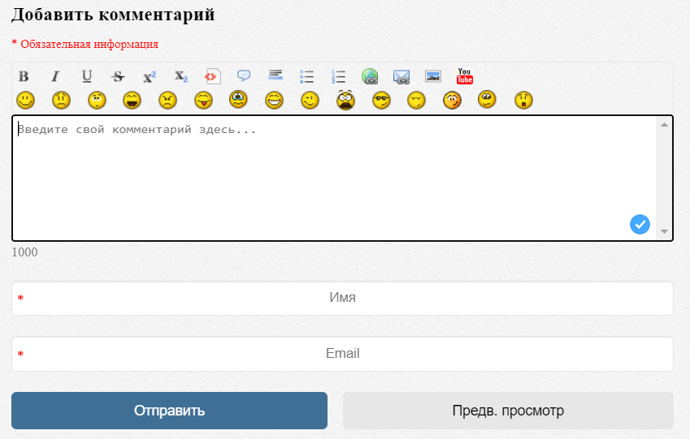
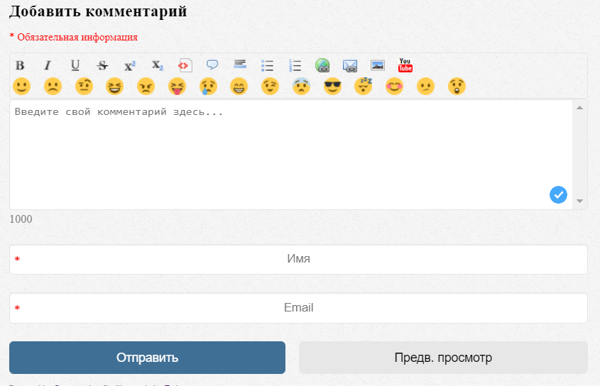
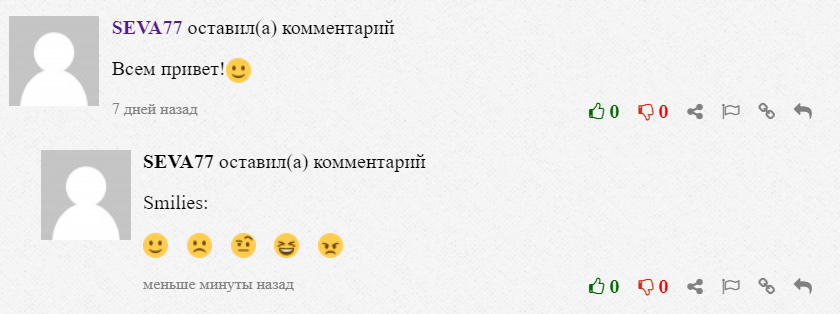

# Twemoji for Commentics

Basic set of smilies from [Twemoji](https://github.com/twitter/twemoji) for [Commentics](https://github.com/commentics/commentics) to replace the standard one. Smilies made by [Twitter](https://github.com/twitter).

I did this for Commentics version 4.1.

To use, replace the ***smilies*** folder in `frontend/view/default/image/` with a folder from this repository.

You should also take into account that emoticons are licensed under the Creative Commons Attribution 4.0 International Public License. Should pay attention to [its terms](https://creativecommons.org/licenses/by/4.0/deed.en). I am not the creator in this case.

The MIT License applies to my source code, if any.

## Screenshots from my blog:

**Before**

**After**

**Comments**

